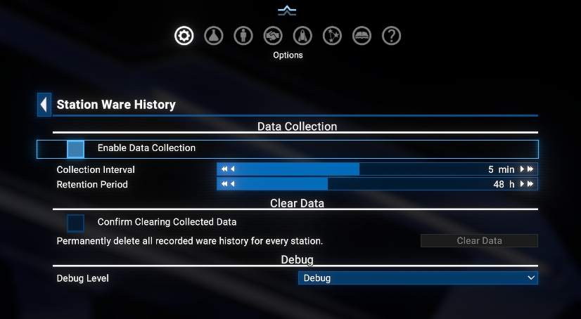
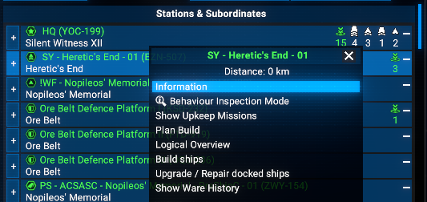
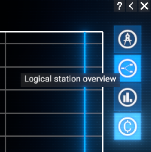
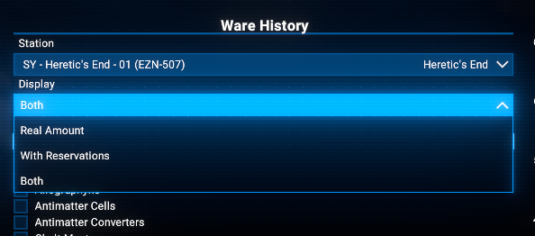
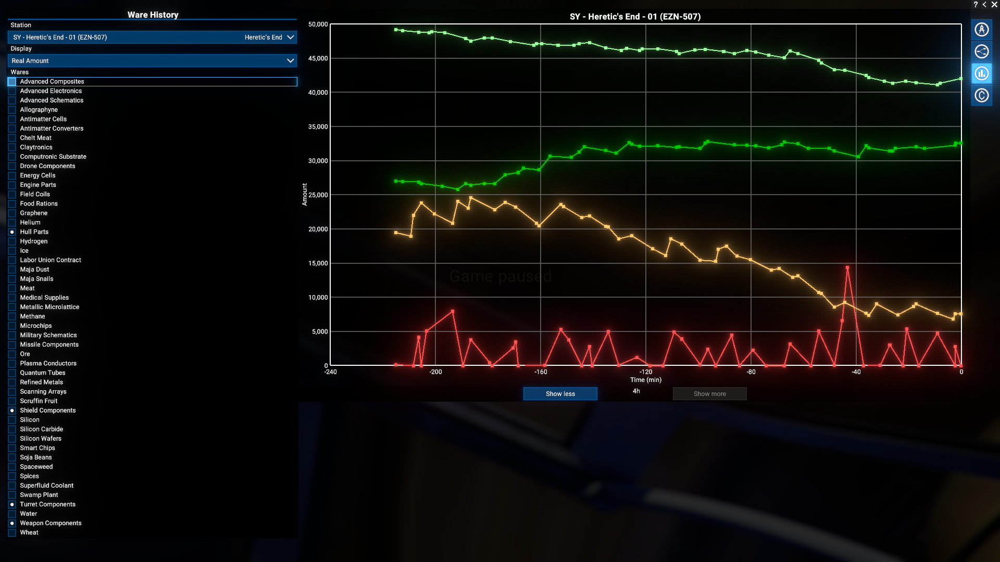
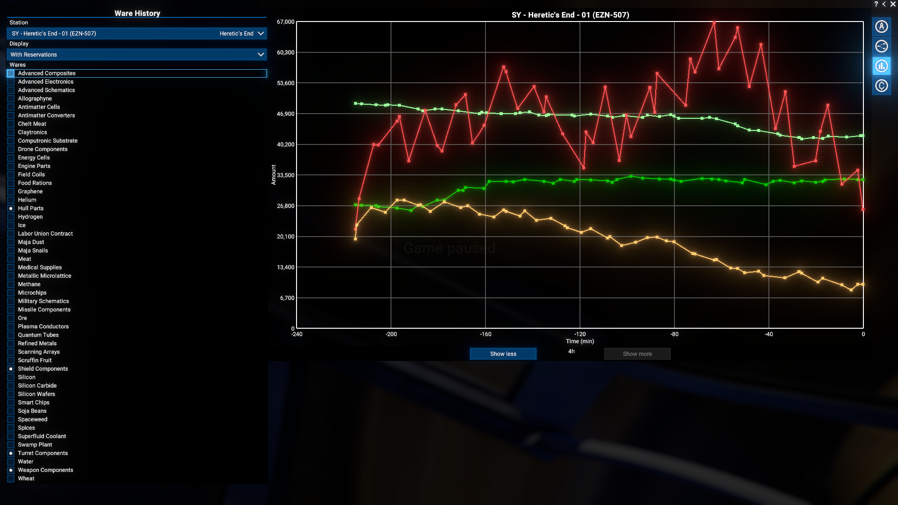
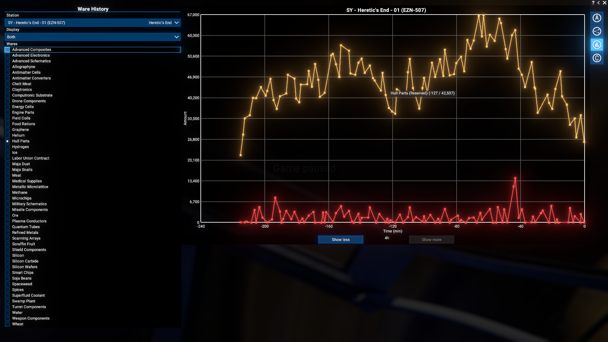

# Station Ware History

Periodically samples ware stock on every player-owned station and lets you graph the history per station. Tracks both the raw stock amount and the reservation-corrected amount (accounting for pending buy/sell trades), with a configurable sampling interval and retention window. Access via the station's right-click interaction menu, or via a dedicated entry in the station menu's right-side bar.

## Features

- **Per-station, per-ware history**: Tracks every ware a station produces, consumes, trades, or needs for its workforce - including wares currently sitting at zero stock - not just whatever happens to be in cargo at sample time.
- **Real Amount and With Reservations, both stored**: Every sample stores the raw stock amount *and* the reservation-corrected amount (buy reservations subtract stock about to leave, sell reservations add stock about to arrive). Switching which one you view never requires re-collecting history.
- **Graph menu**: A standalone menu (opened from the station's interaction menu, or from a **Station Ware History** icon in the station's right-side bar) with a station dropdown, a checkbox per tracked ware (up to 8 shown at once), and a multi-series graph.
- **Display modes**: View **Real Amount**, **With Reservations**, or **Both** (two lines per shown ware) per ware.
- **Show Less / Show More zoom**: Continuous doubling/halving of the visible time window, floored at 15 minutes and capped by however much history the selected station actually has - no fixed step list.
- **Stays honest about stale data**: The graph's time axis is always anchored on the current time, so "show more"/"show less" mean exactly what they say. If data collection has been turned off for a while, each line visibly stops short of "now" instead of misleadingly stretching to the present; if nothing was collected within the visible window at all, the graph says so instead of drawing a blank line.
- **Configurable sampling interval and retention**: Collection interval from 1 to 10 minutes (default 5); retention window from 10 to 120 hours (default 48). Disabled by default - turn it on in the extension options when you want to start tracking.
- **Clear Data**: An extension-options button to permanently wipe all recorded history, gated behind a confirmation checkbox and only available while data collection is disabled.
- **Compatible with X4 8.00 and 9.00**.

## Requirements

- **X4: Foundations**: Version **8.00** or higher.
- **Mod Support APIs**: Version 1.95 or higher by [SirNukes](https://next.nexusmods.com/profile/sirnukes?gameId=2659):
  - Available on Steam: [SirNukes Mod Support APIs](https://steamcommunity.com/sharedfiles/filedetails/?id=2042901274)
  - Available on Nexus Mods: [Mod Support APIs](https://www.nexusmods.com/x4foundations/mods/503)
- **Options Helper**: Version 1.10 or higher by [Chem O`Dun](https://next.nexusmods.com/profile/ChemODun/mods?gameId=2659):
  - Available on Steam: [Options Helper](https://steamcommunity.com/sharedfiles/filedetails/?id=3715253556)
  - Available on Nexus Mods: [Options Helper](https://www.nexusmods.com/x4foundations/mods/2089)

## Installation

- **Steam Workshop**: [Station Ware History](https://steamcommunity.com/sharedfiles/filedetails/?id=3748682047)
- **Nexus Mods**: [Station Ware History](https://www.nexusmods.com/x4foundations/mods/2178)

## Usage

### Enabling data collection

Data collection is **disabled by default**. Open **Options Menu > Extension Options > Station Ware History** and enable **Enable Data Collection** to start sampling. Adjust **Collection Interval** (1-10 minutes) and **Retention Period** (10-120 hours) as needed.

### Graph Limitations

Due to engine limitations on total data points, graph capacity depends on your display settings:

- Absolute Maximum: Up to 8 wares simultaneously under ideal conditions.
- Standard Limit: No more than 5 wares under normal use.
- "Both" Mode: Limited to 2 wares (since this mode doubles the lines per ware).

When the limit ill be reached, checkboxes for additional wares will be disabled.

### Opening the history graph

- Right-click any player-owned station and choose **Show Ware History** from the interaction menu.

  

- Or open any of that station's menus (**Station configuration**, **Logical station overview**, **Transaction Log**) and click the **Show Ware History** button in the right-side bar.

  

### The graph menu

- **Station**: Switch between any player-owned station with recorded history without closing the menu. Display mode and zoom carry over to the new station (re-clamped to its own data range); selected wares are kept only where they also exist on the new station.
- **Display**: Choose **Real Amount**, **With Reservations**, or **Both**.
  - **With Reservations** is a default option that shows the stock amount as it should be once all pending trades are executed.
  - **Both** is unavailable once 3 or more wares are checked.

  

- **Wares**: Check up to 8 wares (4 in "Both" mode) to plot. Each gets its own colour, assigned in the order you check them and remembered across reopens.
- **Show Less / Show More**: Shrink or widen the visible time window. "Show More" disables once the window already covers the station's full recorded history.

### Example graph

- Four wares with real amount:

  

- Same station and wares with reservations instead of real amount:

  

- Same station and two wares with both real and reservation-corrected values:

  

### Clear Data

**Options Menu > Extension Options > Station Ware History > Clear Data**: with data collection disabled, tick **Confirm Clearing Collected Data** and click **Clear Data** to permanently delete all recorded history for every station.

## Credits

- **Author**: Chem O`Dun, on [Nexus Mods](https://next.nexusmods.com/profile/ChemODun/mods?gameId=2659) and [Steam Workshop](https://steamcommunity.com/id/chemodun/myworkshopfiles/?appid=392160)
- *"X4: Foundations"* is a trademark of [Egosoft](https://www.egosoft.com).

## Acknowledgements

- [EGOSOFT](https://www.egosoft.com) - for the X series.
- [SirNukes](https://next.nexusmods.com/profile/sirnukes?gameId=2659) - for the `Mod Support APIs` that power the interaction menu, options menu, and timer.

## Changelog

### [8.00.02] - 2026-06-21

- **Added**
  - Initial version: data collection, graph menu, configurable interval/retention, Clear Data.
